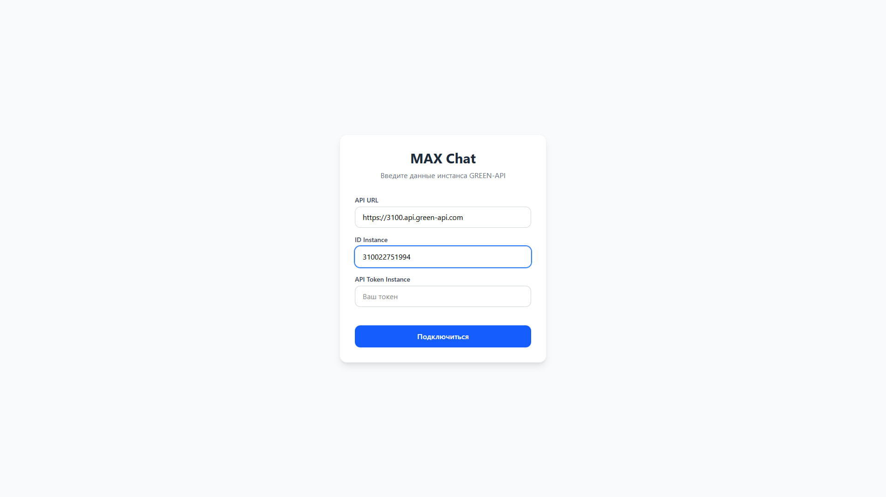
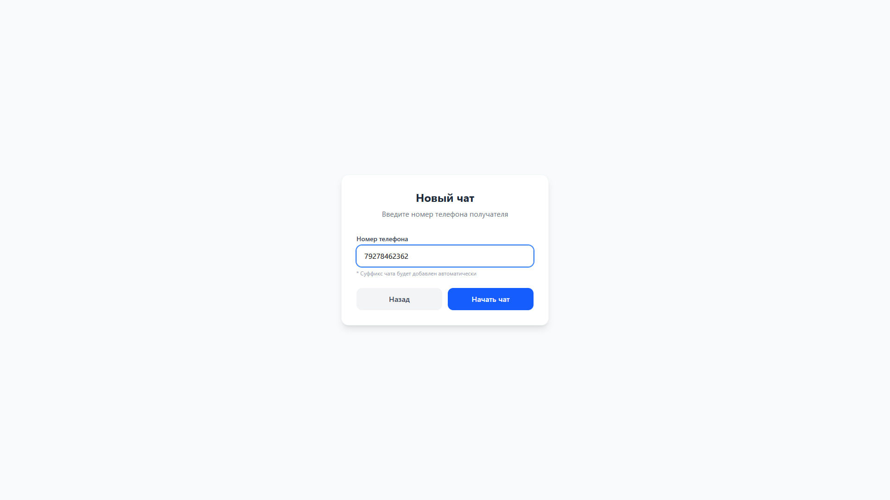
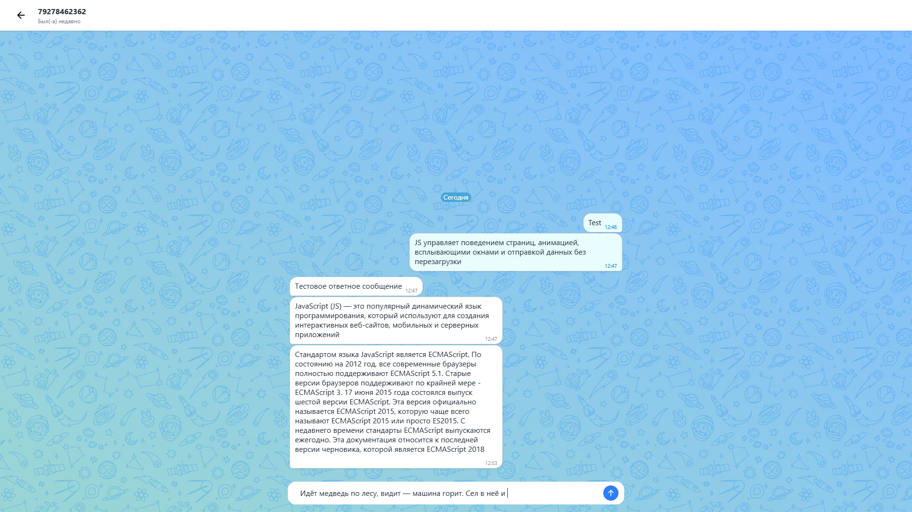

# MAX Chat (Green-API Integration)


**Live Demo:** [https://alex14vdk.github.io/max-chat/](https://alex14vdk.github.io/max-chat/)

Тестовое задание на должность Frontend разработчика React.  
Веб-интерфейс для отправки и получения текстовых сообщений в мессенджере MAX через шлюз [GREEN-API](https://green-api.com/max).

## Функционал

- Авторизация через учётные данные инстанса GREEN-API (`idInstance`, `apiTokenInstance`, `apiUrl`) с сохранением в `localStorage`.
- Отправка текстовых сообщений.
- Автоматическое получение входящих сообщений через HTTP API (polling каждые 3 секунды).
- Корректная обработка очереди уведомлений (`receiveNotification` + `deleteNotification`).
- Разделители дат между группами сообщений ("Сегодня", "Вчера", "DD.MM.YYYY").
- Группировка сообщений по отправителю с визуальным разделением.
- Автоматическое увеличение поля ввода до 228px при наборе длинного текста.
- Адаптивный интерфейс, стилизованный под веб-версию мессенджера MAX (включая кастомный SVG-паттерн фона).
- Кастомный скроллбар, появляющийся только при наведении.

## Технологический стек

- **Vite 8** + **React 19** + **TypeScript 6**
- **Tailwind CSS 4** (для стилизации и адаптивности)
- **Custom Hooks** (для инкапсуляции бизнес-логики и side-эффектов)
- **Fetch API** (для взаимодействия с GREEN-API)

## Архитектура

Проект использует **модульную компонентную архитектуру** с чётким разделением ответственности (Single Responsibility Principle):

```
src/
├── api/              # Слой взаимодействия с GREEN-API (класс GreenApiClient)
├── types/            # Централизованные TypeScript-интерфейсы
├── hooks/            # Кастомные хуки (useChat — polling, автоскролл, отправка)
├── utils/            # Утилиты (форматирование дат)
├── components/       # Переиспользуемые UI-компоненты
│   ├── MessageBubble.tsx
│   ├── MessageInput.tsx
│   ├── ChatBackground.tsx
│   └── DateSeparator.tsx
├── pages/            # Компоненты страниц (Auth, ChatList, Chat)
└── assets/           # Статические ресурсы (SVG-паттерн)
```

> **Security Note**: В рамках тестового задания запросы к GREEN-API выполняются напрямую с фронтенда для простоты демонстрации. В продакшене рекомендуется использовать backend-прокси, чтобы не раскрывать `apiTokenInstance`.

## Локальный запуск

### Системные требования

- **Node.js** версии 18 или выше ([скачать](https://nodejs.org/))
- **npm** версии 9 или выше (поставляется вместе с Node.js)
- Учётные данные инстанса GREEN-API (см. раздел [Использование](#-использование))

### 1. Клонирование репозитория

```bash
git clone https://github.com/<your-username>/max-chat.git
cd max-chat
```

### 2. Установка зависимостей

```bash
npm install
```

### 3. Запуск в режиме разработки

```bash
npm run dev
```

Приложение будет доступно по адресу [http://localhost:5173](http://localhost:5173).

### 4. Сборка для продакшена (опционально)

```bash
npm run build
```

Готовые файлы появятся в папке `dist/`. Для локального просмотра собранной версии:

```bash
npm run preview
```

## Использование

### Получение учётных данных GREEN-API

1. Зарегистрируйтесь на [green-api.com](https://green-api.com/).
2. Создайте инстанс для мессенджера **MAX** в личном кабинете.
3. Авторизуйте инстанс, отсканировав QR-код в приложении MAX на телефоне.
4. Скопируйте `idInstance` и `apiTokenInstance` из настроек инстанса.

### Работа с приложением

1. **Авторизация**: Откройте приложение и введите `apiUrl`, `idInstance` и `apiTokenInstance` вашего инстанса. Данные сохраняются в `localStorage`, повторный ввод не требуется.
2. **Создание чата**: Введите номер телефона формате `79876624994`.
3. **Отправка сообщений**: Напишите текст в поле ввода и нажмите `Enter` (или кнопку отправки).
4. **Получение ответов**: Ответы собеседника из приложения MAX будут автоматически отображаться в чате.
5. **Выход**: Нажмите кнопку "Назад" на экране выбора чата, чтобы очистить данные авторизации.

## Доступные скрипты

| Команда | Описание |
|---|---|
| `npm run dev` | Запуск dev-сервера с HMR |
| `npm run build` | TypeScript-компиляция + сборка Vite |
| `npm run preview` | Предварительный просмотр production-сборки |

## Скриншоты

| Экран авторизации                 |
| --------------------------------- |
|    |

| Контакт                            |
|------------------------------------|
|  |


| Чат                             |
|---------------------------------|
|  |
---

**Контакты для связи**: Telegram — @alex14vdk
